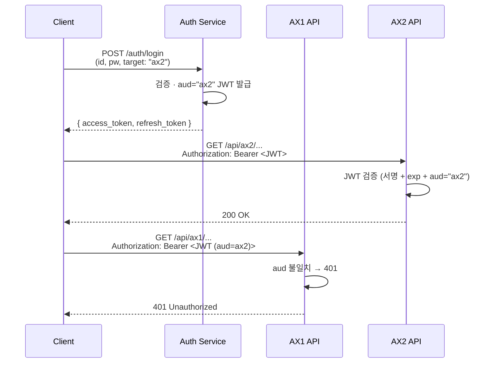

# Auth Strategy · `aud` 기반 JWT

> 상위 문서: [[00 - Backend (Index)]]
> 이전: [[01 - Overview]]

> [!summary] 한 줄로 말하면
> **Auth 서버 1곳이 JWT를 발급**하고, 발급 시 JWT의 `aud` (audience) 클레임으로 **어느 AX 서비스 대상인지** 명시한다. 각 AX 서비스는 자신의 `aud`가 아닌 토큰은 거부한다.

---

## 1. 전체 플로우



---

## 2. JWT 클레임 설계

| 클레임 | 예시 값 | 설명 |
|--------|--------|------|
| `iss` | `https://auth.changshin.io` | 발급자 (Auth 서버) |
| `sub` | `user-uuid-1234` | 사용자 ID |
| `aud` | `ax1` / `ax2` / `ax3` | **대상 서비스** (단일 또는 배열) |
| `iat` | `1714000000` | 발급 시각 |
| `exp` | `1714003600` | 만료 시각 (access 토큰: 예 1h) |
| `jti` | `uuid` | 토큰 고유 ID (차단 리스트 관리용) |
| `roles` | `["admin", "user"]` | 역할 (선택) |
| `scope` | `"read write"` | 권한 스코프 (선택) |

### 2-1. `aud` 값 정의

| 값 | 의미 |
|----|------|
| `"ax1"` | AX1 API 전용 |
| `"ax2"` | AX2 API 전용 |
| `"ax3"` | AX3 API 전용 |
| `["ax1", "ax2"]` | (선택) 다중 서비스 접근 허용 |

> [!tip] 다중 aud
> 한 사용자가 AX1과 AX2를 모두 접근해야 할 때 배열로 발급 가능. 다만 단순성을 위해 **초기엔 단일 `aud`로 시작**하고, 필요 시 확장.

### 2-2. `aud` 선택 방식

로그인 엔드포인트 호출 시 클라이언트가 명시:

```http
POST /auth/login
Content-Type: application/json

{
  "username": "user@example.com",
  "password": "...",
  "target": "ax2"         // ← 어느 서비스로 로그인할지
}
```

또는 사용자가 특정 AX 서비스에 접속 중인 경우 **서비스별 엔드포인트**:

```
POST /auth/ax1/login  → aud=ax1
POST /auth/ax2/login  → aud=ax2
POST /auth/ax3/login  → aud=ax3
```

> **권장**: 후자 (`/auth/<svc>/login`). URL 자체가 의도를 드러내 가독성·감사성이 좋다.

---

## 3. Auth 서버 구현 포인트

보일러플레이트의 기존 Auth 컨트롤러(`apps/<template>/src/controllers/auth/`)를 기반으로 확장.

### 3-1. 발급 로직 (`auth.service.ts` 수정)

- 로그인 요청에서 `target`(또는 URL path)에 따라 `aud` 세팅
- JWT 서명: **비대칭 키(RS256)** 사용 권장 → 공개키를 각 AX 서비스가 검증에 사용
- Refresh 토큰도 별도 발급 (DB 또는 Redis에 저장)

### 3-2. 공개키 노출

```
GET /auth/.well-known/jwks.json
```

- 표준 JWKS 포맷으로 공개키 노출
- 각 AX 서비스가 기동 시 fetch + 캐시 + 주기 갱신

### 3-3. 엔드포인트 예시

| 메서드 | 경로 | 설명 |
|--------|------|------|
| `POST` | `/auth/ax1/login` | AX1 대상 로그인 (`aud=ax1`) |
| `POST` | `/auth/ax2/login` | AX2 대상 로그인 |
| `POST` | `/auth/ax3/login` | AX3 대상 로그인 |
| `POST` | `/auth/refresh` | Refresh 토큰으로 재발급 (동일 `aud` 유지) |
| `POST` | `/auth/logout` | 로그아웃 (토큰 차단 리스트 등록) |
| `GET` | `/auth/me` | 토큰 기반 내 정보 조회 |
| `GET` | `/auth/.well-known/jwks.json` | 공개키 노출 |

---

## 4. AX 서비스(AX1/2/3) 검증 로직

각 AX 서비스는 보일러플레이트의 `authentication.guard.ts`를 기반으로 수정:

### 4-1. 기본 동작

1. `Authorization: Bearer <token>` 헤더 파싱
2. Auth 서버의 JWKS로 서명 검증
3. `exp`, `iat` 검증
4. **`aud` 값이 자신의 서비스 ID와 일치하는지 확인** ← 핵심
5. 불일치 시 `401 Unauthorized` 또는 `403 Forbidden`

### 4-2. NestJS 구현 스케치

```typescript
// libs/auth/src/jwt-audience.guard.ts
@Injectable()
export class JwtAudienceGuard implements CanActivate {
  constructor(
    @Inject('EXPECTED_AUD') private readonly expectedAud: string,
    private readonly jwksClient: JwksClient,
  ) {}

  async canActivate(ctx: ExecutionContext): Promise<boolean> {
    const req = ctx.switchToHttp().getRequest();
    const token = extractBearer(req.headers.authorization);
    if (!token) throw new UnauthorizedException();

    const payload = await this.verifyToken(token); // 서명/exp 검증
    const aud = Array.isArray(payload.aud) ? payload.aud : [payload.aud];
    if (!aud.includes(this.expectedAud)) {
      throw new UnauthorizedException('aud mismatch');
    }

    req.user = payload;
    return true;
  }
}
```

### 4-3. 앱별 설정

```typescript
// apps/ax1-api/src/ax1-api.module.ts
@Module({
  providers: [
    { provide: 'EXPECTED_AUD', useValue: 'ax1' },
    JwtAudienceGuard,
  ],
})
```

→ AX2는 `'ax2'`, AX3는 `'ax3'`로 설정.

---

## 5. 키 관리

### 5-1. 키 저장

- **AWS Secrets Manager** (프로덕션) / `.env` (로컬)
- External Secrets로 K8s Secret 동기화 ([[Infrastructure/20 - AWS Deployment#2. 사용할 AWS 서비스 매핑]])

### 5-2. 키 로테이션

- 주기: 90일 권장
- 방식: **keys.jwks**에 **이전 키 + 신규 키 병존** → 충분한 유예 후 이전 키 제거
- 각 AX 서비스가 JWKS를 주기 갱신(예: 10분)하므로 무중단 로테이션 가능

---

## 6. 토큰 차단 리스트 · 로그아웃

- JWT는 stateless라 **로그아웃 시 즉시 무효화** 어렵다
- **옵션 A**: `jti`를 Redis에 blacklist 저장 (짧은 TTL로 성능 ↓ 최소화)
- **옵션 B**: 짧은 access 토큰 수명 + refresh 토큰 무효화
- **권장**: B (단순) + 중요 액션(결제 등)에만 A 적용

---

## 7. 보안 원칙

> [!warning] 필수
> - **HTTPS 전용** (로컬 제외)
> - `Authorization` 헤더 외 쿠키로 보낼 경우 `SameSite=strict; HttpOnly; Secure`
> - Access 토큰 수명 **짧게** (예 1h 이내)
> - Refresh 토큰은 DB/Redis에 저장하고 **일회용화** (rotate on use)
> - 비밀번호 해싱: `argon2` 또는 `bcrypt`(cost ≥ 12)
> - Rate limiting: 로그인 엔드포인트 기본 적용

> 보일러플레이트의 `.claude/rules/auth-security.md`에 더 자세한 규칙이 있을 가능성 — 실제 구현 시 참조.

---

## 8. 테스트 시나리오

- [ ] `aud=ax1` 토큰으로 AX1 호출 → 200
- [ ] `aud=ax1` 토큰으로 AX2 호출 → 401
- [ ] 만료된 토큰 → 401
- [ ] 서명 깨진 토큰 → 401
- [ ] JWKS 갱신 후 이전 토큰도 grace period 내 허용
- [ ] 로그아웃 후 refresh 토큰 재사용 시도 → 거부
- [ ] `aud` 배열인 토큰 (다중 서비스) → 해당 서비스들만 허용

---

## 열린 질문

- [ ] Access 토큰 수명 (15m / 1h / etc.)
- [ ] Refresh 토큰 저장소 (DB vs Redis)
- [ ] `aud` 다중 발급 허용 여부
- [ ] SSO·OIDC 외부 IdP 연동 여부
- [ ] 로그인 실패 시 잠금 정책 (5회/N분 등)
- [ ] MFA 도입 여부·시점

---

> 다음: [[20 - Service Template]]
