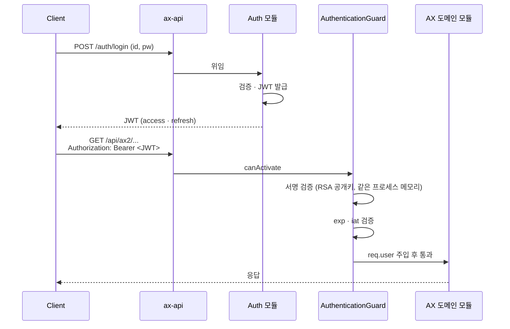

# Auth Strategy · 단일 서비스 JWT

> 상위 문서: [[00 - Backend (Index)]]
> 이전: [[01 - Overview]]

> [!summary] 한 줄로 말하면
> Auth 모듈이 같은 프로세스 안에서 **JWT를 발급**하고, 모든 도메인 모듈이 **공통 가드(`AuthenticationGuard`)** 로 같은 JWT를 검증한다. 외부 IdP 미사용 (자체 JWT, [[Infrastructure/31 - Decision Log#D-009|D-009]]).

> [!warning] 2026-04-28 변경
> 4서비스 분리 시기에는 `aud=ax1|ax2|ax3`로 토큰을 **서비스별로** 발급할 계획이었으나 ([[Infrastructure/31 - Decision Log#D-007|D-007]]), 단일 서비스로 통합되면서 그 의미가 약화되었다. `aud` 처리 방향은 후속 결정 ([[Infrastructure/31 - Decision Log#미결정 · 논의 필요|미결정]]).

---

## 1. 전체 플로우 (단일 서비스)



핵심: 서비스 간 호출 없음. JWKS HTTP fetch 없음(같은 프로세스 메모리에서 공개키 사용).

---

## 2. JWT 클레임 (현재 안)

| 클레임 | 예시 | 설명 |
|--------|------|------|
| `iss` | `https://changshin-api.dev.weplanet.co.kr` | 발급자 |
| `sub` | `user-uuid-1234` | 사용자 ID |
| `aud` | (TBD) | **재정의 예정** — 아래 §4 참조 |
| `iat` | `1714000000` | 발급 시각 |
| `exp` | `1714003600` | 만료 시각 (access: 1h 권장) |
| `jti` | `uuid` | 토큰 고유 ID |
| `roles` | `["admin", "user"]` | 역할 |
| `scope` | `"ax1.read ax2.write"` | 권한 스코프 (선택) |

---

## 3. Auth 모듈 구현 포인트

기존 `changshin-auth-api`의 자산을 `apps/ax-api/src/modules/auth/`로 흡수하면서 정리:

### 3-1. 엔드포인트 (현행 가정)

| 메서드 | 경로 | 설명 |
|--------|------|------|
| `POST` | `/auth/login` | 로그인 (id/pw → JWT 발급) |
| `POST` | `/auth/register` | 회원가입 |
| `POST` | `/auth/refresh` | Refresh 토큰으로 access 재발급 |
| `POST` | `/auth/logout` | 로그아웃 (refresh 토큰 무효화) |
| `POST` | `/auth/password/reset-request` | 비밀번호 재설정 요청 |
| `POST` | `/auth/password/reset` | 비밀번호 재설정 |
| `GET` | `/auth/me` | 내 정보 조회 |
| `GET` | `/auth/health` | 헬스체크 |

### 3-2. 키 저장

- RSA 키 페어는 **K8s Secret(`auth-jwt`)** 로 주입 ([[Infrastructure/31 - Decision Log#D-018|D-018]])
- 같은 프로세스에서 발급·검증하므로 **JWKS 외부 노출은 선택 사항**
  - 외부 시스템(예: ERP webhook 검증)에서 토큰 검증이 필요하면 노출
  - 그렇지 않으면 노출하지 않아도 됨

### 3-3. Refresh 토큰

- DB 또는 Redis에 저장 (rotate on use 권장)
- Access 토큰 짧게 (1h 이내) + Refresh 짧지 않게 (예: 14d)

---

## 4. `aud` 클레임 재정의 옵션 (후속 결정 필요)

[[Infrastructure/31 - Decision Log#D-007|D-007]]의 `aud=ax1|ax2|ax3` 분기는 단일 서비스에서 **서비스 라우팅 의미가 사라짐**. 다음 중 선택 필요:

### 옵션 A: 제거

- JWT에 `aud` 미포함
- 가장 단순. 도메인 권한 분리는 `roles` · `scope`로 표현
- 추천도: ⭐⭐⭐

### 옵션 B: 클라이언트 컨텍스트 구분

- `aud=web | mobile | erp-webhook | partner-app`
- 발행 컨텍스트별로 다른 정책(만료 시간 · CORS · 로깅) 적용 가능
- 추천도: ⭐⭐ (필요해질 때 도입)

### 옵션 C: 도메인 권한 표현 (scope과 통합)

- `aud=["ax1", "ax2"]` 식으로 어느 도메인에 접근 가능한지 표현
- 도메인 진입점 가드에서 검증
- 사실상 `scope`와 중복 → `scope` 사용을 권장

> **권장 시작**: 옵션 A로 단순화. 필요 시 옵션 B로 확장.

---

## 5. AuthenticationGuard 동작

`apps/ax-api/src/guards/authentication.guard.ts`(보일러플레이트 기반 + 정리):

```typescript
@Injectable()
export class AuthenticationGuard implements CanActivate {
  constructor(
    private readonly jwtService: JwtService,
    @Inject(JWT_PUBLIC_KEY) private readonly publicKey: string,
  ) {}

  async canActivate(ctx: ExecutionContext): Promise<boolean> {
    const req = ctx.switchToHttp().getRequest();
    const token = extractBearer(req.headers.authorization);
    if (!token) throw new UnauthorizedException();

    const payload = await this.jwtService.verifyAsync(token, {
      publicKey: this.publicKey,
      algorithms: ['RS256'],
      // issuer: env.JWT_ISSUER  // 선택
      // audience: env.JWT_AUDIENCE  // aud 옵션 결정 후
    });

    req.user = payload;
    return true;
  }
}
```

도메인 모듈은 별도 가드 없이 `@UseGuards(AuthenticationGuard)` 만 붙이면 된다.

---

## 6. 권한 분기 (Authorization)

도메인별 권한은 `AuthorizationGuard` 또는 데코레이터로 처리:

```typescript
@UseGuards(AuthenticationGuard, AuthorizationGuard)
@Roles('admin', 'production_planner')
@RequiredScopes('ax2.write')
@Post('/api/ax2/orders')
```

> 보일러플레이트의 `.claude/rules/auth-security.md`에 더 자세한 가드/데코레이터 컨벤션 있음.

---

## 7. 키 관리

### 7-1. 키 저장

- 프로덕션: K8s Secret(`auth-jwt`) — 수동 생성 ([[Infrastructure/31 - Decision Log#D-018|D-018]])
- 로컬: `apps/ax-api/.env`에 PEM 직접 입력

### 7-2. 키 로테이션

- 빈도: 90일 권장 (수동)
- 동시 활성: 새 키 발급 후 일정 기간 이전 키도 검증 허용 → 기존 토큰 점진 만료
- 모든 사용자 강제 로그아웃이 필요하면 키 즉시 교체 + Redis로 토큰 차단

---

## 8. 보안 원칙

> [!warning] 필수
> - **HTTPS 전용** (로컬 제외)
> - Access 토큰 수명 짧게 (예: 1h 이내)
> - Refresh 토큰 일회용화 (rotate on use), 저장소(DB/Redis)에서 관리
> - 비밀번호 해싱: `argon2` 또는 `bcrypt`(cost ≥ 12)
> - 로그인 엔드포인트 Rate Limiting 기본 적용
> - 보일러 `.claude/rules/auth-security.md` 준수

---

## 9. 테스트 시나리오

- [ ] 정상 로그인 → JWT 발급 → 도메인 API 호출 200
- [ ] 만료 토큰 → 401
- [ ] 서명 깨진 토큰 → 401
- [ ] Refresh 토큰으로 재발급
- [ ] 로그아웃 후 refresh 토큰 재사용 시도 → 거부
- [ ] (옵션 B 채택 시) 잘못된 `aud`로 호출 → 거부

---

## 열린 질문

> 모든 미완 항목은 [[00 - Action Board]] 에서 관리. 본 문서 관련:
> - `aud` 클레임 옵션 결정 → [[00 - Action Board#A. changshin-api 통합 마무리 (D-019 후속)]]
> - Access·Refresh 토큰 수명 / 저장소 / MFA / 외부 IdP → [[00 - Action Board#📥 백로그 (다음 사이클 / 결정·답변 도착 시 진행)]]

---

> 다음: [[20 - Service Template]]
