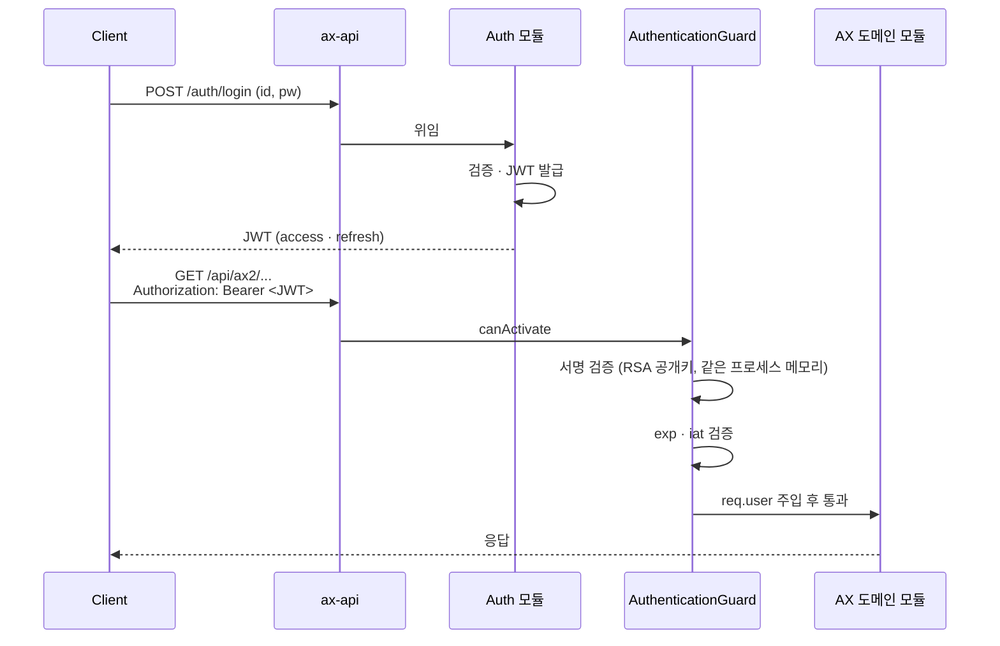

# Auth Strategy · 단일 서비스 JWT

> 상위 문서: [[00 - Backend (Index)]]
> 이전: [[01 - Overview]]

> [!summary] 한 줄로 말하면
> Auth 모듈이 같은 프로세스 안에서 **JWT를 발급**하고, 모든 도메인 모듈이 **공통 가드(`AuthenticationGuard`)** 로 같은 JWT를 검증한다. 외부 IdP 미사용 (자체 JWT, [[Infrastructure/31 - Decision Log#D-009|D-009]]).

> [!info] 2026-04-29 결정 ([[Infrastructure/31 - Decision Log#D-024|D-024]])
> `aud` 는 **위플래닛 표준** `'user' / 'admin'` 두 값으로 채택. 서비스 분기(`ax1|ax2|ax3`, [[Infrastructure/31 - Decision Log#D-007|D-007]])는 [[Infrastructure/31 - Decision Log#D-019|D-019]] 단일 통합 + [[Infrastructure/31 - Decision Log#D-023|D-023]] URL 분리 방식 결정으로 의미 소멸. `aud=admin` = 시스템 관리자·마스터 계정, `aud=user` = 외주처·ODM·창신 일반 직원.

---

## 1. 전체 플로우 (단일 서비스)



핵심: 서비스 간 호출 없음. JWKS HTTP fetch 없음(같은 프로세스 메모리에서 공개키 사용).

---

## 2. JWT 클레임 (현재 안)

| 클레임 | 예시 | 설명 |
|--------|------|------|
| `iss` | `https://changshin-api.dev.weplanet.co.kr` | 발급자 |
| `sub` | `user-uuid-1234` | 사용자 ID |
| `aud` | `user` 또는 `admin` | 클라이언트 종류 식별 ([[Infrastructure/31 - Decision Log#D-024|D-024]]). `/admin/*` → admin, 그 외 → user |
| `iat` | `1714000000` | 발급 시각 |
| `exp` | `1714003600` | 만료 시각 (access: 1h 권장) |
| `jti` | `uuid` | 토큰 고유 ID |
| `roles` | `["admin", "user"]` | 역할 |
| `scope` | `"ax1.read ax2.write"` | 권한 스코프 (선택) |

---

## 3. Auth 모듈 구현 포인트

기존 `changshin-auth-api`의 자산을 `apps/ax-api/src/modules/auth/`로 흡수하면서 정리:

### 3-1. 엔드포인트 (현행 가정)

| 메서드 | 경로 | 설명 |
|--------|------|------|
| `POST` | `/auth/login` | 로그인 (id/pw → JWT 발급) |
| `POST` | `/auth/register` | 회원가입 |
| `POST` | `/auth/refresh` | Refresh 토큰으로 access 재발급 |
| `POST` | `/auth/logout` | 로그아웃 (refresh 토큰 무효화) |
| `POST` | `/auth/password/reset-request` | 비밀번호 재설정 요청 |
| `POST` | `/auth/password/reset` | 비밀번호 재설정 |
| `GET` | `/auth/me` | 내 정보 조회 |
| `GET` | `/auth/health` | 헬스체크 |

### 3-2. 키 저장

- RSA 키 페어는 **K8s Secret(`auth-jwt`)** 로 주입 ([[Infrastructure/31 - Decision Log#D-018|D-018]])
- 같은 프로세스에서 발급·검증하므로 **JWKS 외부 노출은 선택 사항**
  - 외부 시스템(예: ERP webhook 검증)에서 토큰 검증이 필요하면 노출
  - 그렇지 않으면 노출하지 않아도 됨

### 3-3. Refresh 토큰

- DB 또는 Redis에 저장 (rotate on use 권장)
- Access 토큰 짧게 (1h 이내) + Refresh 짧지 않게 (예: 14d)

---

## 4. `aud` 클레임 — 위플래닛 표준 `user / admin` ([[Infrastructure/31 - Decision Log#D-024|D-024]])

### 값 정의

| `aud` | 대상 | 경로 |
|------|------|------|
| `admin` | 시스템 관리자 · 마스터 계정 · 운영 화면 | `/admin/*` |
| `user` | 외주처 · ODM · 창신 일반 직원 | 그 외 모든 도메인 경로 |

### Strategy 분리

```ts
// AUDIENCE='user' (외주처·ODM·창신 일반 직원)
class JwtStrategy extends PassportStrategy(Strategy, 'jwt') { ... }

// AUDIENCE='admin' (마스터 계정·관리자)
class JwtAdminStrategy extends PassportStrategy(Strategy, 'jwt-admin') { ... }
```

- 쿠키 분리: `user-access-token` / `admin-access-token` (refresh 도 동일)
- Redis 세션 키 분리: `{aud}:{sub}:version`, `userRefreshTokens:{aud}:{sub}` — `@system/jwt` 가 자동 처리
- 데코레이터: `@Auth({ type: 'admin' })` / `@Auth({ type: 'user' })` (위플래닛 표준)

### 경로 매핑 (보일러 표준)

```
/admin/*  → JwtAdminStrategy
그 외      → JwtStrategy (user)
```

`AuthenticationGuard` 가 prefix 로 strategy 분기 (`.claude/rules/auth-security.md` §"경로 기반 Strategy" 참조).

### 미채택 옵션 (참고)

- **완전 제거**: `@system/jwt` 공유 패키지 + Redis 키 마이그레이션 비용 큼. 위플래닛 보일러 컨벤션 위반
- **클라이언트 컨텍스트** (`web/mobile/erp-webhook`): "웹 only + 반응형 웹"([[Infrastructure/31 - Decision Log#D-023|D-023]]) 으로 web/mobile 분기 무의미. ERP 연동 답변 대기 중 — **필요 시 D-024 위에 `aud=erp-webhook` 추가** 가능 (별도 D-### 발행)
- **도메인 권한 표현** (`aud=["ax1","ax2"]`): `roles` · `scope` 와 중복 → `scope` 사용

---

## 5. AuthenticationGuard 동작

`apps/ax-api/src/guards/authentication.guard.ts`(보일러플레이트 기반 + 정리):

```typescript
@Injectable()
export class AuthenticationGuard implements CanActivate {
  constructor(
    private readonly jwtService: JwtService,
    @Inject(JWT_PUBLIC_KEY) private readonly publicKey: string,
  ) {}

  async canActivate(ctx: ExecutionContext): Promise<boolean> {
    const req = ctx.switchToHttp().getRequest();
    const token = extractBearer(req.headers.authorization);
    if (!token) throw new UnauthorizedException();

    const payload = await this.jwtService.verifyAsync(token, {
      publicKey: this.publicKey,
      algorithms: ['RS256'],
      // issuer: env.JWT_ISSUER  // 선택
      // audience: 'user' or 'admin'  // 경로 기반 strategy 분기 (D-024)
    });

    req.user = payload;
    return true;
  }
}
```

도메인 모듈은 별도 가드 없이 `@UseGuards(AuthenticationGuard)` 만 붙이면 된다.

---

## 6. 권한 분기 (Authorization)

도메인별 권한은 `AuthorizationGuard` 또는 데코레이터로 처리:

```typescript
@UseGuards(AuthenticationGuard, AuthorizationGuard)
@Roles('admin', 'production_planner')
@RequiredScopes('ax2.write')
@Post('/api/ax2/orders')
```

> 보일러플레이트의 `.claude/rules/auth-security.md`에 더 자세한 가드/데코레이터 컨벤션 있음.

---

## 7. 키 관리

### 7-1. 키 저장

- 프로덕션: K8s Secret(`auth-jwt`) — 수동 생성 ([[Infrastructure/31 - Decision Log#D-018|D-018]])
- 로컬: `apps/ax-api/.env`에 PEM 직접 입력

### 7-2. 키 로테이션

- 빈도: 90일 권장 (수동)
- 동시 활성: 새 키 발급 후 일정 기간 이전 키도 검증 허용 → 기존 토큰 점진 만료
- 모든 사용자 강제 로그아웃이 필요하면 키 즉시 교체 + Redis로 토큰 차단

---

## 8. 보안 원칙

> [!warning] 필수
> - **HTTPS 전용** (로컬 제외)
> - Access 토큰 수명 짧게 (예: 1h 이내)
> - Refresh 토큰 일회용화 (rotate on use), 저장소(DB/Redis)에서 관리
> - 비밀번호 해싱: `argon2` 또는 `bcrypt`(cost ≥ 12)
> - 로그인 엔드포인트 Rate Limiting 기본 적용
> - 보일러 `.claude/rules/auth-security.md` 준수

---

## 9. 테스트 시나리오

- [ ] 정상 로그인 → JWT 발급 → 도메인 API 호출 200
- [ ] 만료 토큰 → 401
- [ ] 서명 깨진 토큰 → 401
- [ ] Refresh 토큰으로 재발급
- [ ] 로그아웃 후 refresh 토큰 재사용 시도 → 거부
- [ ] `/admin/*` 에 `aud=user` 토큰으로 호출 → 401 (D-024)
- [ ] 그 외 경로에 `aud=admin` 토큰으로 호출 → 401 또는 strategy 매칭 실패 (D-024)

---

## 열린 질문

> 모든 미완 항목은 [[00 - Action Board]] 에서 관리. 본 문서 관련:
> - ✅ `aud` 클레임 옵션 결정 → [[Infrastructure/31 - Decision Log#D-024]] (위플래닛 표준 user/admin)
> - Access·Refresh 토큰 수명 / 저장소 / MFA / 외부 IdP → [[00 - Action Board#📥 백로그 (다음 사이클 / 결정·답변 도착 시 진행)]]

---

> 다음: [[20 - Service Template]]
