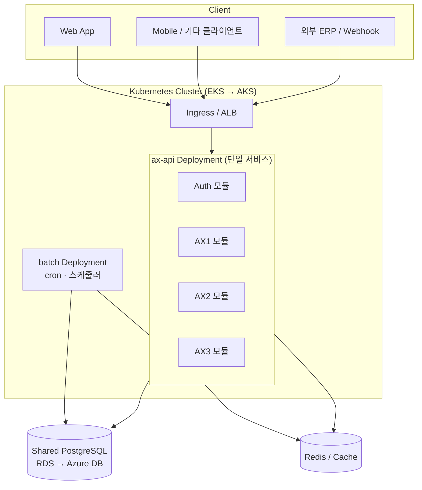

# Infrastructure Overview

> 상위 문서: [[00 - Infrastructure (Index)]]

> [!abstract] 한 줄 요약
> 창신 AX 시리즈(AX1 · AX2 · AX3)를 **단일 통합 API 서비스**로 구성. 공유 DB · 모듈러 모놀리스 전략. **K8s on AWS(EKS)**로 운영 중이며 향후 **Azure(AKS) 이전** 가능.

> [!warning] 2026-04-28 아키텍처 변경
> 초기에는 4대 서버(Auth + AX1/2/3 API)로 분리 설계했으나, 개발팀 내부 논의로 **단일 통합 API 서비스**로 변경됨 ([[31 - Decision Log#D-019|D-019]]).
> 본 문서는 **현재(2026-04-28) 기준**으로 정리되어 있다. 4서버 시기의 결정·문서는 [[31 - Decision Log#D-001|D-001]]/[[31 - Decision Log#D-007|D-007]] 등을 참조 (superseded).

---

## 1. 프로젝트 맥락

- **도메인 영역**: AX1, AX2([[AX-2 지능형 스케줄러/00 - AX-2 쉬운 설명서 (Index)|AX-2 지능형 스케줄러]]), AX3 — 모두 **하나의 API 서비스 안에서 모듈로 분리**해 구현
- **아키텍처**: **모듈러 모놀리스** (NestJS monorepo의 `apps/ax-api/` 단일 앱 + 도메인별 모듈 디렉터리)
- **저장소**: GitLab `changshin/changshin-api` 1개
- **앱 구성**: `apps/ax-api/` (HTTP API) + `apps/batch/` (cron · 배치) — 한 리포에서 빌드, K8s에는 각각 별도 Deployment로 배포
- **데이터베이스**: 단일 PostgreSQL RDS, 도메인별 스키마 논리 분리 유지 (`auth.*`, `ax1.*`, `ax2.*`, `ax3.*`, `common.*`)

> [!info] 분리 비용 보존 전략
> 단일 서비스로 운영하더라도 **DB 스키마 · 모듈 경계는 분리 상태로 유지**. 향후 다시 서비스 분리가 필요해질 때 비용을 낮춘다.

## 2. 배포 플랫폼

| 항목 | 현재 (Phase 1) | 미래 (Phase 2) |
|------|--------------|--------------|
| 클라우드 | AWS | Azure |
| 오케스트레이션 | **Kubernetes (EKS)** | **Kubernetes (AKS)** |
| 워크로드 | API 1개 + Batch 1개 | API 1개 + Batch 1개 |
| IaC | Terraform (`changshin-iac`) | Terraform (재사용) |

> [!info] 보일러플레이트 → 사내 IaC
> 보일러플레이트: `/Users/yoohakseon/Documents/GitLab/weplanet/weplanet-starter-iac`
> 실제 IaC 리포: `/Users/yoohakseon/Documents/GitLab/changshin/changshin-iac`
> EKS · RDS · ElastiCache · ALB · Route53 · ECR · Flux(GitOps) · Karpenter · External Secrets 등이 모듈화되어 있음. 자세한 매핑은 [[20 - AWS Deployment]] 참고.

## 3. 핵심 설계 원칙

- **K8s 기반** — 클라우드 종속도 최소화 (AWS → Azure 이전 시 K8s 매니페스트 대부분 재사용 가능)
- **단일 API 서비스 + 모듈러 모놀리스** — 운영·개발 단순성 우선. 도메인 모듈 경계는 코드 수준에서 명시 ([[31 - Decision Log#D-019|D-019]])
- **공유 DB + 논리 분리 유지** — 스키마 단위로 도메인 분리, 향후 분리 가능성 보존
- **JWT 기반 인증** — Auth 모듈이 JWT 발급, 같은 서비스 내 가드가 검증 ([[31 - Decision Log#D-009|D-009]])
- **GitOps** — Flux로 K8s 매니페스트 선언적 관리
- **마이그레이션 친화 설계** — 클라우드 특정 서비스(AWS-only)는 최소화

## 4. 상위 구성도

자세한 아키텍처는 [[10 - Architecture]] 참고.

## 5. 문서 로드맵

| 문서 | 용도 |
|------|------|
| [[10 - Architecture]] | 시스템 아키텍처 · 모듈 경계 · 통신 흐름 |
| [[20 - AWS Deployment]] | AWS(EKS) 배포 설계 · `changshin-iac` 모듈 매핑 |
| [[30 - Azure Migration]] | Azure(AKS) 이전 전략 · 매핑 |
| [[31 - Decision Log]] | 주요 기술 선택과 근거 (D-001 ~ D-019) |
| [[32 - Deployment State]] | 구축 완료/진행 상태 · 핵심 참조값 |

---

## 열린 질문

- [ ] D-019 후속: `aud` 클레임 처리 방향 (제거 vs 클라이언트 컨텍스트 구분 재정의)
- [ ] D-019 후속: Ingress path 단순화 (`/auth`, `/api/ax{1,2,3}` → `/api/*` 통합)
- [ ] D-019 후속: ECR 리포 통폐합 (4세트 → 1세트)
- [ ] 멀티 AZ · HA 수준 (개발/스테이징/운영 차등)
- [ ] Azure 이전 예상 시기 · 트리거 조건
- [ ] 환경 분리 정책 (dev/stage/prod)

---

> 다음: [[10 - Architecture]]
