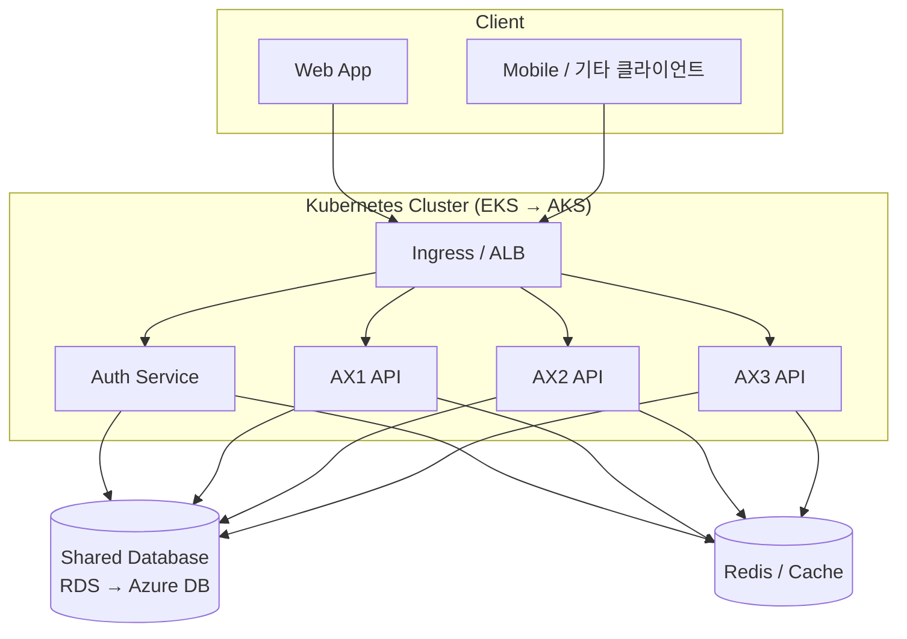

# Infrastructure Overview

> 상위 문서: [[00 - Infrastructure (Index)]]

> [!abstract] 한 줄 요약
> 창신 AX 시리즈(AX1 · AX2 · AX3)를 **4대 서버 기반 마이크로서비스**로 구성. 공통 인증 + 공통 DB 전략. **K8s on AWS**로 시작해 향후 **Azure로 이전**.

---

## 1. 프로젝트 맥락

- **서비스**: AX1, AX2([[AX-2 지능형 스케줄러/00 - AX-2 쉬운 설명서 (Index)|AX-2 지능형 스케줄러]]), AX3
- **아키텍처**: 마이크로서비스 (MSA)
- **총 서버 수**: 4대
  - **Auth Server** — 공통 인증 · 인가
  - **AX1 API Server**
  - **AX2 API Server**
  - **AX3 API Server**
- **데이터베이스**: 4개 서비스가 **공유 DB 한 개** 사용 (스키마/로직 수준 분리)

## 2. 배포 플랫폼

| 항목 | 현재 (Phase 1) | 미래 (Phase 2) |
|------|--------------|--------------|
| 클라우드 | AWS | Azure |
| 오케스트레이션 | **Kubernetes (EKS)** | **Kubernetes (AKS)** |
| IaC | Terraform (보일러플레이트 활용) | Terraform (재사용) |

> [!info] 보일러플레이트
> `/Users/yoohakseon/Documents/GitLab/weplanet/weplanet-starter-iac`
> EKS · RDS · ElastiCache · ALB · Route53 · ECR · Flux(GitOps) · Karpenter · External Secrets 등이 모듈화되어 있음. 자세한 매핑은 [[20 - AWS Deployment]] 참고.

## 3. 핵심 설계 원칙

- **K8s 기반** — 클라우드 종속도 최소화 (AWS → Azure 이전 시 K8s 매니페스트 대부분 재사용 가능)
- **공유 DB + 논리 분리** — 초기 개발·운영 단순성 우선, 스키마/테이블 prefix로 서비스별 분리
- **인증 중앙화** — Auth 서버가 JWT/세션 발급 관리, AX1/2/3은 토큰 검증만
- **GitOps** — Flux로 K8s 매니페스트 선언적 관리
- **마이그레이션 친화 설계** — 클라우드 특정 서비스(AWS-only)는 최소화

## 4. 상위 구성도 (개략)

자세한 아키텍처는 [[10 - Architecture]] 참고.

## 5. 문서 로드맵

| 문서 | 용도 |
|------|------|
| [[10 - Architecture]] | 시스템 아키텍처 · 서비스 경계 · 통신 흐름 |
| [[20 - AWS Deployment]] | AWS(EKS) 배포 설계 · 보일러플레이트 매핑 |
| [[30 - Azure Migration]] | Azure(AKS) 이전 전략 · 매핑 |
| [[31 - Decision Log]] | 주요 기술 선택과 근거 |

---

## 열린 질문

- [ ] 멀티 AZ · HA 수준 (개발/스테이징/운영 차등)
- [ ] Azure 이전 예상 시기 · 트리거 조건
- [ ] 환경 분리 정책 (dev/stage/prod)

---

> 다음: [[10 - Architecture]]
