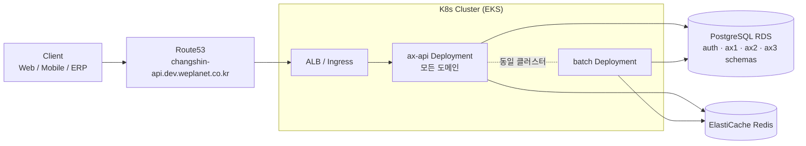
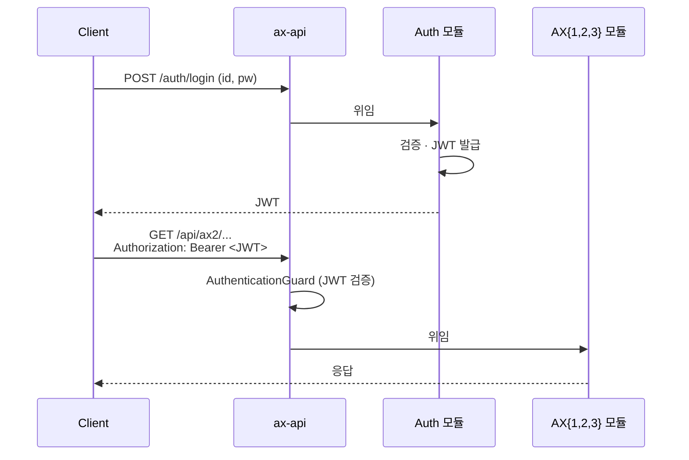

# System Architecture

> 상위 문서: [[00 - Infrastructure (Index)]]
> 이전: [[01 - Overview]]

> [!summary] 한 줄로 말하면
> **단일 통합 API(`ax-api`) + 배치(`batch`) + 공유 PostgreSQL + Redis + K8s Ingress 단일 진입점** 구조. 도메인(Auth/AX1/AX2/AX3)은 같은 서비스 안의 **모듈 디렉터리로 분리**.

> [!warning] 2026-04-28 변경
> 4서비스 분리에서 **단일 통합 서비스**로 변경됨 ([[31 - Decision Log#D-019|D-019]]).

---

## 1. 서비스 구성

### 1-1. `ax-api` (단일 API 서비스)

**역할**: 모든 HTTP 요청을 처리하는 단일 NestJS 서비스. 도메인은 모듈 디렉터리 단위로 분리.

| 모듈 | 역할 | 라우팅 prefix(잠정) |
|------|------|--------------------|
| **Auth 모듈** | 사용자 인증·인가, JWT 발급, 가드/스트래티지 | `/auth/*` |
| **AX1 모듈** | AX1 도메인 비즈니스 로직 | `/api/ax1/*` |
| **AX2 모듈** | [[AX-2 지능형 스케줄러/00 - AX-2 쉬운 설명서 (Index)\|AX-2 지능형 스케줄러]] 도메인 (납기 예측 · 생산 계획 · 물류 · 정산) | `/api/ax2/*` |
| **AX3 모듈** | AX3 도메인 비즈니스 로직 | `/api/ax3/*` |

> [!info] 모듈 경계 보존
> 같은 서비스 안에서 운영되더라도 **도메인 모듈은 독립 디렉터리·독립 컨트롤러·독립 스키마**로 유지. 향후 다시 분리(MSA 회귀)할 때 비용을 낮춘다.

### 1-2. `batch` (배치/스케줄러)

- NestJS 별도 앱(`apps/batch/`)
- cron 기반 스케줄러 (예: 납기 예측 배치, 알림 발송, 외부 ERP 동기화)
- 같은 코드베이스, 같은 DB · 도메인 모듈 import 가능
- K8s에는 별도 Deployment로 배포

---

## 2. 공유 데이터베이스 전략

> [!important] 핵심 결정
> 단일 PostgreSQL RDS 인스턴스 + **스키마 단위 논리 분리** 유지. ([[31 - Decision Log#D-002|D-002]] · [[31 - Decision Log#D-008|D-008]])

### 2-1. 스키마 분리

- `auth.*` — 사용자, 권한, 세션, 토큰 메타
- `ax1.*` — AX1 도메인 테이블
- `ax2.*` — AX2 도메인 테이블 ([[AX-2 지능형 스케줄러/02 - Module 1 · 납기일 예측|M1]] ~ [[AX-2 지능형 스케줄러/05 - Module 4 · 구매 · 정산|M4]])
- `ax3.*` — AX3 도메인 테이블
- `common.*` — 조직 · 사용자 메타 · 공통 코드 등

### 2-2. 단일 서비스에서의 접근 규칙

- **DB 연결은 1개**(단일 connection pool · 단일 사용자 계정)
- 하지만 **TypeORM 엔티티 정의·마이그레이션 파일은 도메인별로 분리** (`apps/ax-api/src/modules/<도메인>/entities/`, `apps/ax-api/src/modules/<도메인>/migrations/`)
- ORM 엔티티의 `@Entity({ schema: 'ax2', name: 'orders' })` 처럼 스키마를 명시
- 향후 서비스 재분리 시 스키마 단위로 떼어내기 쉬움

### 2-3. 캐시·세션

- ElastiCache(Redis) 1개 — 세션 · refresh token · 캐시 공용
- key prefix로 도메인 분리 (예: `auth:session:*`, `ax2:cache:*`)

> 자세한 결정 맥락: [[31 - Decision Log#D-002 공유 DB 채택]]

---

## 3. 네트워크 · 트래픽 흐름

### 3-1. 라우팅 (현행)

- 임시 도메인: `changshin-api.dev.weplanet.co.kr` ([[31 - Decision Log#D-015]])
- Path 기반 라우팅 ([[31 - Decision Log#D-011]])

| Path | 라우팅 대상 |
|------|-----------|
| `/auth/*` | `ax-api` (Auth 모듈이 처리) |
| `/api/ax1/*` | `ax-api` (AX1 모듈이 처리) |
| `/api/ax2/*` | `ax-api` (AX2 모듈이 처리) |
| `/api/ax3/*` | `ax-api` (AX3 모듈이 처리) |

> [!question] 단순화 검토
> 단일 서비스로 통합되면서 path 기반 분기가 **외부 가시성** 외엔 의미가 줄었다. `/api/*`로 단일 prefix 통합도 검토 가치 있음 ([[31 - Decision Log#미결정 · 논의 필요]] 참조).

### 3-2. 인증 플로우

- JWT 검증은 **같은 프로세스 내 가드**가 처리 (서비스 간 호출 불필요)
- RSA 서명키는 K8s Secret(`auth-jwt`)으로 주입 ([[31 - Decision Log#D-018|D-018]])
- 외부 노출용 JWKS(`/auth/.well-known/jwks.json`)는 **외부 시스템에 토큰 검증을 위임할 때만** 필요 — 단일 서비스 내부에서는 선택 사항

### 3-3. `aud` 클레임 (재정의 예정)

원래 `aud=ax1|ax2|ax3` 분기로 서비스 라우팅에 활용 예정이었으나(D-007), 단일 서비스로 변경되면서 의미 약화. 현재 옵션:

- **제거** — JWT에 `aud` 미포함, 단순화
- **클라이언트 컨텍스트로 재정의** — `aud=web | mobile | erp-webhook` 등 발행 컨텍스트 구분
- **권한 스코프와 통합** — `aud` 대신 `scope: "ax1.read ax2.write"` 등으로 도메인 권한 표현

→ 후속 결정 필요 ([[31 - Decision Log#미결정 · 논의 필요]])

---

## 4. 서비스 간 통신

> [!info] 단일 서비스이므로 서비스 간 통신은 대부분 사라짐
> 도메인 간 호출은 **NestJS DI를 통한 모듈 간 직접 호출**(같은 프로세스 내). 네트워크 hop 없음.
> 외부 시스템(ERP · ODM 창고)과의 통신은 **REST/Webhook**(D-010 적용 그대로).
> 비동기 배치는 `apps/batch/` 또는 NestJS 큐(예: BullMQ + Redis)로 처리.

---

## 5. 환경 분리

| 환경 | K8s 클러스터 | DB | 비고 |
|------|-------------|------|------|
| `dev` | `changshin-dev` | `changshin-dev-changshin` (PostgreSQL) | 현재 운영 중 |
| `stage` | (예정) `changshin-stage` | (예정) | 후속 |
| `prod` | (예정) `changshin-prod` | (예정) Multi-AZ | 후속 |

namespace는 환경 무관 `changshin` ([[31 - Decision Log#D-017]]). 환경 식별은 클러스터 단위로.

---

## 6. 관측성 · 로깅

- **메트릭**: Prometheus + Grafana (`changshin-iac` 의 `eks-infra/observability.tf` 적용 완료)
- **로그**: CloudWatch Logs (AWS) → 향후 OpenTelemetry 어댑터 도입 검토
- **분산 추적**: 단일 서비스 + 같은 프로세스 내 모듈 호출이 다수라 우선순위 낮음

---

## 열린 질문

> 모든 미완 항목은 [[00 - Action Board]] 에서 관리. 본 문서 관련:
> - `aud` 처리 / Ingress path 단순화 → [[00 - Action Board#A. changshin-api 통합 마무리 (D-019 후속)]]
> - 도메인 모듈 DI 경계 / ERP webhook 라우팅 위치 → [[00 - Action Board#📥 백로그 (다음 사이클 / 결정·답변 도착 시 진행)]]

---

> 다음: [[20 - AWS Deployment]]
