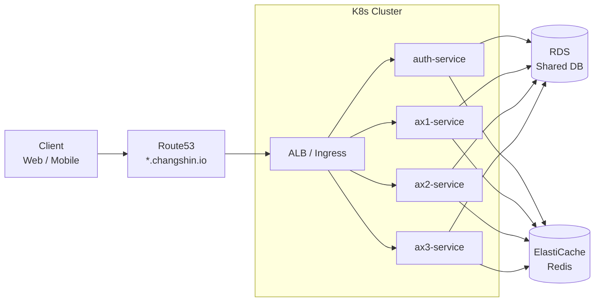
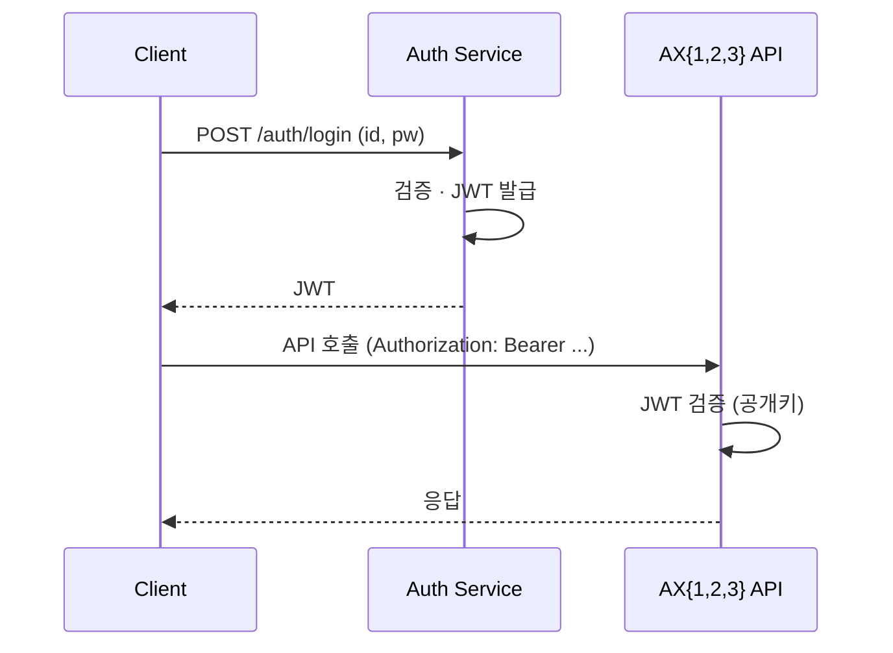

# System Architecture

> 상위 문서: [[00 - Infrastructure (Index)]]
> 이전: [[01 - Overview]]

> [!summary] 한 줄로 말하면
> **4개 마이크로서비스 (Auth + AX1/2/3 API) + 공유 DB + K8s Ingress 단일 진입점** 구조.

---

## 1. 서비스 구성

### 1-1. Auth Service

**역할**: 인증·인가 중앙화

- 사용자 로그인 · 세션 · JWT 발급
- 권한(Role/Permission) 관리
- AX1/2/3 API가 토큰을 검증할 때 참조 (공개키 또는 introspection)
- OAuth2 / OIDC 호환 고려 (미래 외부 IdP 연동 여지)

### 1-2. AX1 API Server

- AX1 비즈니스 로직 담당
- 공유 DB의 AX1 전용 스키마/테이블 소유

### 1-3. AX2 API Server

- [[AX-2 지능형 스케줄러/00 - AX-2 쉬운 설명서 (Index)|AX-2 지능형 스케줄러]] 백엔드
- 공유 DB의 AX2 전용 스키마/테이블 소유
- 외부 ERP 연동, 배치/스케줄링 로직 포함 가능

### 1-4. AX3 API Server

- AX3 비즈니스 로직 담당
- 공유 DB의 AX3 전용 스키마/테이블 소유

---

## 2. 공유 데이터베이스 전략

> [!important] 핵심 결정
> 4개 서비스가 **하나의 물리 DB 인스턴스를 공유**한다. 분리는 **논리 수준**(스키마/테이블 prefix)에서 수행.

### 2-1. 장점

- 초기 운영 단순 (관리 대상 DB 1개)
- 서비스 간 공통 데이터(사용자·조직·권한) 조인 용이
- 비용 효율 (RDS 인스턴스 1개)

### 2-2. 단점 · 리스크

- **서비스 간 결합도 ↑** — DB 스키마 변경이 다른 서비스에 영향
- **스케일링 단위가 DB 전체** — 특정 서비스의 부하가 전체에 영향
- **MSA 원칙 위배** (순수한 의미의)

### 2-3. 논리 분리 규칙

- 스키마 분리: `auth.*`, `ax1.*`, `ax2.*`, `ax3.*`
- 공통 테이블은 `common.*` 스키마
- **서비스는 자기 스키마 + `common` 읽기만 허용**, 다른 서비스 스키마 직접 접근 금지
- DB 권한도 스키마 단위로 계정 분리

> 자세한 결정 맥락: [[31 - Decision Log#D-002 공유 DB 채택]]

---

## 3. 네트워크 · 트래픽 흐름

### 3-1. 라우팅

도메인/경로 기반 라우팅은 Ingress 규칙으로 선언:

| Path | 라우팅 대상 |
|------|-----------|
| `/auth/*` | auth-service |
| `/api/ax1/*` | ax1-service |
| `/api/ax2/*` | ax2-service |
| `/api/ax3/*` | ax3-service |

또는 서브도메인 분리: `auth.changshin.io`, `ax1.changshin.io` 등. 선택은 [[31 - Decision Log]] 참조.

### 3-2. 인증 플로우

- JWT 공개키는 Auth의 `/auth/.well-known/jwks.json`으로 노출
- AX1/2/3은 기동 시 캐시 후 주기적 갱신

---

## 4. 서비스 간 통신

- **기본 원칙**: 서비스 간 직접 호출 **지양**. 공유 DB를 통해 느슨하게 결합
- **필요 시**: 동기 REST (내부 ClusterIP 서비스) 또는 비동기 이벤트(SQS/RabbitMQ 등)
- **트랜잭션**: 서비스 경계를 넘는 트랜잭션은 **Saga 패턴** 또는 보상 트랜잭션

---

## 5. 환경 분리

초안. 확정은 [[31 - Decision Log]]에서:

| 환경 | 용도 | K8s 클러스터 | DB |
|------|------|-------------|------|
| `dev` | 개발·테스트 | 공유 클러스터 | 공유 RDS (작은 인스턴스) |
| `stage` | QA · UAT | 공유 or 별도 | 별도 |
| `prod` | 운영 | 별도 클러스터 | 별도 Multi-AZ |

---

## 6. 관측성 · 로깅 (초안)

- **메트릭**: Prometheus + Grafana (EKS 모듈 내 observability 지원)
- **로그**: CloudWatch Logs (AWS) → Azure Monitor Logs 이전 시 매핑
- **분산 추적**: OpenTelemetry 권장 (클라우드 중립)

---

## 열린 질문

- [ ] Saga가 필요한 유스케이스 존재 여부

---

> 다음: [[20 - AWS Deployment]]
