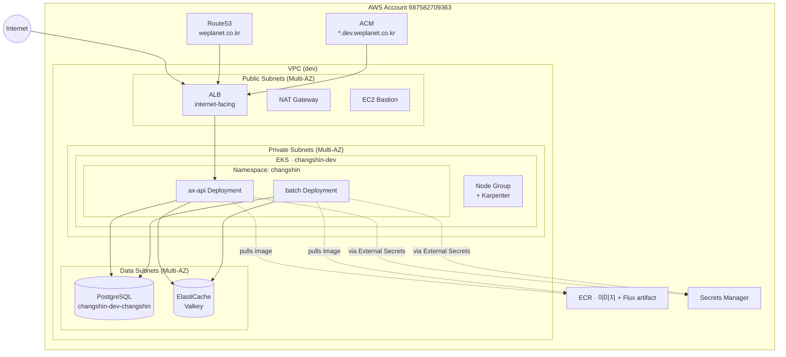
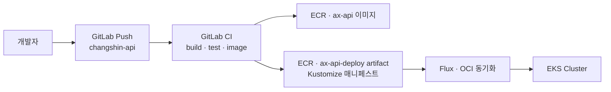

# AWS Deployment (EKS)

> 상위 문서: [[00 - Infrastructure (Index)]]
> 이전: [[10 - Architecture]]

> [!summary] 한 줄로 말하면
> `changshin-iac` Terraform IaC + EKS + Flux(GitOps) 스택 위에 **단일 통합 API(`ax-api`) + 배치(`batch`)** 를 배포한다.

> [!warning] 2026-04-28 변경
> 4서비스 분리 배포 → **단일 서비스 배포**로 변경 ([[31 - Decision Log#D-019|D-019]]). 본 문서는 새 구조 기준.

---

## 1. 인프라 리포 (`changshin-iac`)

**경로**: `/Users/yoohakseon/Documents/GitLab/changshin/changshin-iac`

**구조**:

```
changshin-iac/
├── aws/
│   ├── env.sh / init.sh           ← 초기화 스크립트
│   ├── env/
│   │   ├── _template/             ← 환경별 Terraform 템플릿
│   │   ├── backend/               ← Terraform state backend (state S3)
│   │   ├── base/                  ← 계정 공통 리소스 (ECR · Route53 · ACM · OIDC)
│   │   └── dev/                   ← dev 환경 (vpc · eks · rds · elasticache · ec2-bastion)
│   └── modules/                   ← 재사용 가능한 AWS 모듈 (eks · eks-infra · eks-services 등)
└── k8s/                           ← 인프라/플랫폼 매니페스트 (operators · monitoring · infra · node-pools)
```

> 보일러플레이트(`weplanet-starter-iac`)에서 fork한 후 changshin 프로젝트용으로 customizing.

---

## 2. 사용 중인 AWS 서비스

| 영역 | AWS 서비스 | 모듈 | 비고 |
|------|-----------|------|------|
| **컴퓨팅** | EKS (`changshin-dev`) | `modules/eks`, `eks-infra`, `eks-services` | dev 환경 운영 중 |
| **네트워크** | VPC | `modules/vpc` | dev 환경 |
| **로드밸런서** | ALB (Ingress 자동 생성) | `eks-infra/alb-controller.tf` | path 기반 라우팅 ([[31 - Decision Log#D-011]]) |
| **DB** | RDS (PostgreSQL) | `modules/rds-single` | `changshin-dev-changshin` ([[31 - Decision Log#D-008]]) |
| **캐시** | ElastiCache (Valkey) | `modules/elasticache` | 세션·캐시 |
| **컨테이너 레지스트리** | ECR | `modules/ecr` | 이미지 + Flux artifact ([[31 - Decision Log#D-016]]) |
| **DNS** | Route53 | `modules/route53` | hosted zone `weplanet.co.kr` (`Z2ELFWHU9W34XL`) |
| **TLS 인증서** | ACM | `modules/acm` | `*.dev.weplanet.co.kr` 와일드카드 |
| **시크릿** | Secrets Manager + External Secrets | `eks-infra/external-secrets.tf` | RDS credential 자동 주입 |
| **GitOps** | Flux | `eks-infra/flux.tf` | OCIRepository + Kustomization |
| **오토스케일링** | Karpenter | `eks-infra/karpenter.tf` | 노드 자동 스케일 |
| **관측성** | CloudWatch · Prometheus | `eks-infra/observability.tf` | 적용 완료 |
| **CI/CD** | **GitLab CI (자체 호스팅)** | (사용 안 함) | OIDC AssumeRole ([[31 - Decision Log#D-014]]) |
| **접근 제어** | OIDC for CI | `modules/oidc-provider-ci` | `git.weplanet.co.kr` |
| **Bastion** | EC2 Bastion | `modules/ec2-bastion` | dev 운영 중 |

> [!tip] 비활성화된 모듈
> ECS, OpenSearch, DynamoDB, Lambda, S3-CloudFront, SQS, CodePipeline 등은 현 시점 미사용. 필요 시 활성화.

---

## 3. 배포 토폴로지 (현재)



핵심 참조값(엔드포인트 · ARN · ECR 등)은 [[32 - Deployment State#2. 핵심 참조값]] 참고.

---

## 4. K8s 리소스 구성

### 4-1. 네임스페이스

| Namespace | 용도 |
|-----------|------|
| `changshin` | 앱 워크로드 (`ax-api`, `batch`) — D-017 |
| `flux-system` | Flux |
| `kube-system` | EKS 시스템 |
| `observability` | Prometheus · Grafana 등 |

### 4-2. 워크로드별 리소스

#### `ax-api` (단일 API)

- `Deployment` (replica: dev=1, prod=2+)
- `Service` (ClusterIP)
- `Ingress` (ALB Ingress, group `default`)
- `HorizontalPodAutoscaler` (선택)
- `ConfigMap` (환경 변수)
- `ExternalSecret` (RDS credentials 자동 주입)
- `Secret` 수동 (`auth-jwt` RSA 키, `ax-api-docs` swagger basic auth)
- `ServiceAccount` + Pod Identity association (IAM Role: `changshin-svc-ax-api`)

#### `batch` (배치)

- `Deployment` 또는 `CronJob`
- 같은 DB · Redis 접근 (External Secret 공유)
- `ServiceAccount` 별도 권한 (배치 전용 IAM Role)

### 4-3. GitOps 구조 (Flux + 하이브리드 매니페스트 [[31 - Decision Log#D-013|D-013]])

- **인프라 매니페스트**: `changshin-iac/k8s/` (operators · monitoring · infra · node-pools · cluster 설정)
- **앱 매니페스트**: `changshin-api/k8s/clusters/{env}/` (Deployment · Service · Ingress · ExternalSecret 등)
- Flux가 ECR OCI artifact (`changshin-iac` 레포 + `changshin-{ax-api,batch}-deploy` 레포) 감시

```
# changshin-api repo
k8s/clusters/
├── dev/
│   ├── ax-api/
│   ├── batch/
│   └── kustomization.yaml
├── stage/      ← 예정
└── prod/       ← 예정
```

---

## 5. 환경별 Terraform 구성

| 환경 | 디렉토리 | 상태 |
|------|---------|------|
| `dev` | `aws/env/dev/` | ✅ 운영 중 |
| `stage` | `aws/env/stage/` | 예정 |
| `prod` | `aws/env/prod/` | 예정 |

각 환경에서 활성화된 모듈:

- `vpc.tf`, `eks.tf`, `rds.tf`, `elasticache.tf`, `ec2-bastion.tf`
- `main.tf` + `config.yml` (환경별 변수)

---

## 6. 배포 파이프라인



### 6-1. 브랜치 ↔ 환경 매핑 ([[31 - Decision Log#D-013]])

| 브랜치 | 환경 | 배포 대상 |
|--------|------|----------|
| `develop` | dev | `changshin-dev` |
| `release/*` | stage | `changshin-stage` (예정) |
| `main` | prod | `changshin-prod` (예정) |

### 6-2. CI 인증

- **GitLab OIDC → AWS AssumeRole** (long-lived key 미사용)
- IAM Role: `changshin-oidc-ci`
- OIDC Audience: `flux-deploy`

---

## 7. 비용 관리 가이드

- **개발 환경**: t3.medium 노드 2대, RDS t3.small, Redis 작은 노드
- **Karpenter** 로 필요 시만 노드 확장
- **Spot Instance** 활용 (`base/spot.tf` 참고)
- 야간 · 주말 dev 환경 스케일 다운 고려
- 단일 서비스 통합으로 4벌 → 1벌 리소스 절감 ([[31 - Decision Log#D-019|D-019]])

---

## 8. 운영 명령

운영 명령(kubectl, terraform, flux 등)은 [[32 - Deployment State#3. 운영 명령 모음]] 참고.

---

## 열린 질문

- [ ] 도메인(예: `changshin.io` 등) 확정
- [ ] ECR 통폐합 전략 (4세트 → 1세트)
- [ ] stage/prod 환경 구축 시점·범위

---

> 다음: [[30 - Azure Migration]]
