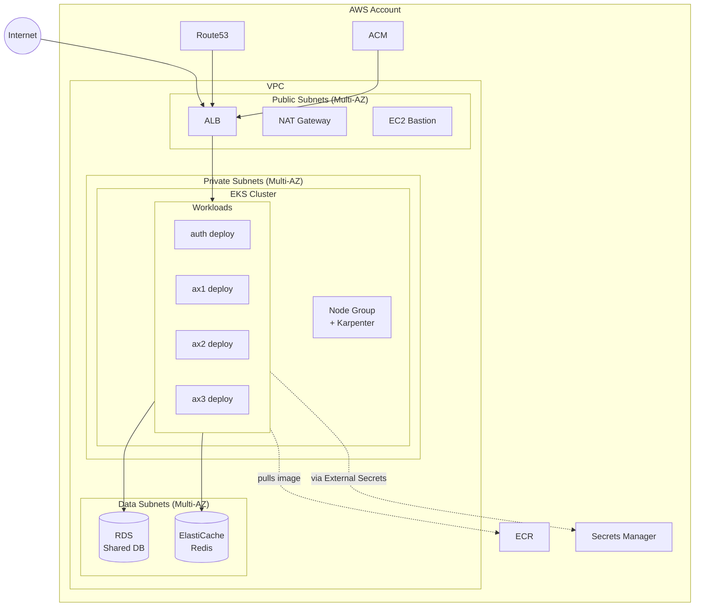
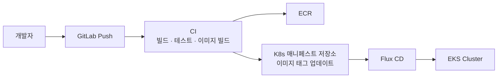

# AWS Deployment (EKS)

> 상위 문서: [[00 - Infrastructure (Index)]]
> 이전: [[10 - Architecture]]

> [!summary] 한 줄로 말하면
> **weplanet-starter-iac 보일러플레이트를 기반으로 Terraform + EKS + Flux(GitOps) 스택 구축.** 필요한 모듈은 이미 다 있음.

---

## 1. 보일러플레이트 개요

**경로**: `/Users/yoohakseon/Documents/GitLab/weplanet/weplanet-starter-iac`

**구조**:

```
weplanet-starter-iac/
├── aws/
│   ├── env/
│   │   ├── _template/     ← 환경별 Terraform 템플릿
│   │   ├── backend/       ← Terraform state backend
│   │   └── base/          ← 기본 인프라 (ACM, ECR, Route53 등)
│   └── modules/           ← 재사용 가능한 AWS 모듈
```

---

## 2. 사용할 AWS 서비스 매핑

| 영역 | AWS 서비스 | 보일러플레이트 모듈 | 비고 |
|------|-----------|-------------------|------|
| **컴퓨팅** | EKS (Kubernetes) | `modules/eks`, `modules/eks-infra`, `modules/eks-services` | 주 워크로드 |
| **네트워크** | VPC | `modules/vpc` | 퍼블릭/프라이빗 서브넷 |
| **로드밸런서** | ALB | `modules/load-balancer`, `eks-infra/alb-controller.tf` | Ingress 대상 |
| **DB (공유)** | RDS | `modules/rds-single` | 초기 단일 인스턴스, 운영은 Multi-AZ |
| **캐시** | ElastiCache (Redis) | `modules/elasticache` | 세션·캐시 |
| **컨테이너 레지스트리** | ECR | `modules/ecr` | 이미지 저장 |
| **DNS** | Route53 | `modules/route53` | 도메인 |
| **TLS 인증서** | ACM | `modules/acm` | HTTPS |
| **시크릿** | Secrets Manager + External Secrets | `eks-infra/external-secrets.tf` | K8s Secret 연동 |
| **GitOps** | Flux | `eks-infra/flux.tf` | K8s 매니페스트 배포 |
| **오토스케일링** | Karpenter | `eks-infra/karpenter.tf` | 노드 자동 스케일 |
| **관측성** | CloudWatch / Prometheus | `eks-infra/observability.tf` | 로그·메트릭 |
| **CI/CD** | CodePipeline | `modules/codepipeline` | 빌드·배포 |
| **접근 제어** | OIDC for CI | `modules/oidc-provider-ci` | GitHub Actions 등 |
| **Bastion** | EC2 Bastion | `modules/ec2-bastion` | 프라이빗 접근 |

---

## 3. 배포 토폴로지



---

## 4. K8s 리소스 설계 (초안)

### 4-1. 네임스페이스

| Namespace | 용도 |
|-----------|------|
| `auth` | Auth 서비스 |
| `ax1` | AX1 서비스 |
| `ax2` | AX2 서비스 |
| `ax3` | AX3 서비스 |
| `shared` | 공통 리소스 (공유 ConfigMap 등) |
| `observability` | Prometheus, Grafana 등 |
| `flux-system` | Flux |

### 4-2. 서비스별 리소스

각 서비스마다 최소 다음 리소스 구성:

- `Deployment` (replica: dev=1, prod=2+)
- `Service` (ClusterIP)
- `Ingress` (ALB Ingress Controller 활용)
- `HorizontalPodAutoscaler`
- `ConfigMap` (환경 변수)
- `ExternalSecret` (DB 비밀번호 등, Secrets Manager → K8s Secret)
- `ServiceAccount` + IRSA (AWS 리소스 접근 시)

### 4-3. GitOps 구조 (Flux)

별도 Git 저장소(예: `changshin-k8s-manifests`)에서 Flux가 동기화. 디렉토리 안:

```
clusters/
├── dev/
│   ├── auth/
│   ├── ax1/
│   ├── ax2/
│   └── ax3/
├── stage/
└── prod/
```

---

## 5. 환경별 Terraform 구성

보일러플레이트의 `aws/env/_template/` 기반으로 복제:

- `aws/env/dev/` — 개발 환경
- `aws/env/stage/` — 스테이징
- `aws/env/prod/` — 운영

각 환경에서 다음 모듈을 선택적으로 활성화:

- `vpc.tf`, `eks.tf`, `rds.tf`, `elasticache.tf`, `load-balancer.tf`

> [!tip] 불필요 모듈
> ECS, OpenSearch, DynamoDB, Lambda 등은 **현 시점에서 비활성화**. 나중에 필요 시 활성화.

---

## 6. 배포 파이프라인 (초안)



- CI 후보: GitHub Actions / GitLab CI / AWS CodePipeline
- 이미지 태그: `git short sha` 사용
- Flux가 Git 감시 → 자동 배포

---

## 7. 비용 관리 가이드

- **개발 환경**: t3.medium 노드 2대, RDS t3.small, Redis 작은 노드
- **Karpenter**로 필요 시만 노드 확장
- **Spot Instance** 활용 (보일러플레이트 `base/spot.tf` 참고)
- 야간 · 주말 dev 환경 스케일 다운 고려

---

## 열린 질문

- [ ] 도메인(예: `changshin.io` 등) 확정

---

> 다음: [[30 - Azure Migration]]
